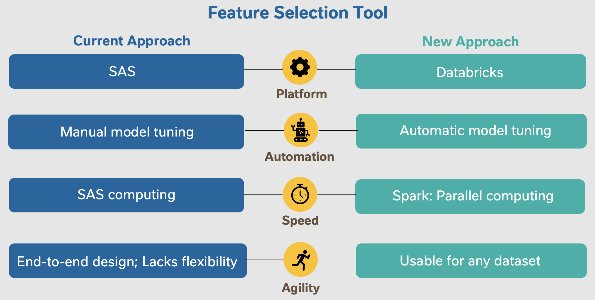
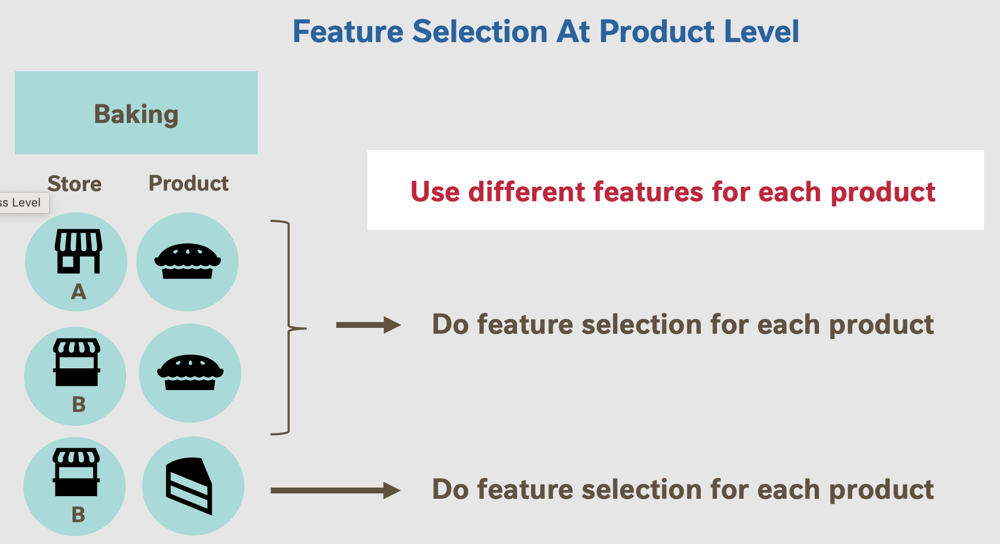
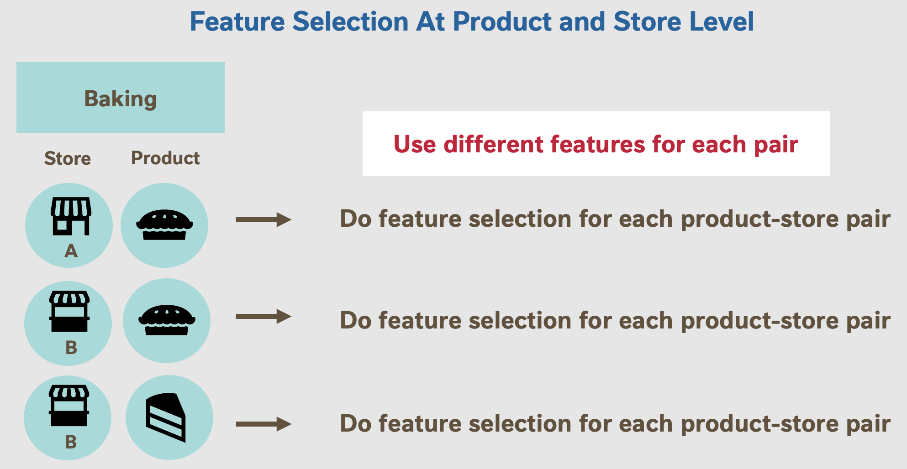
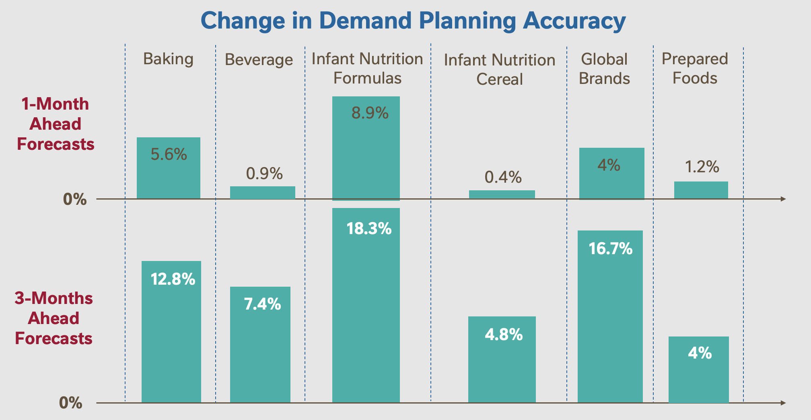
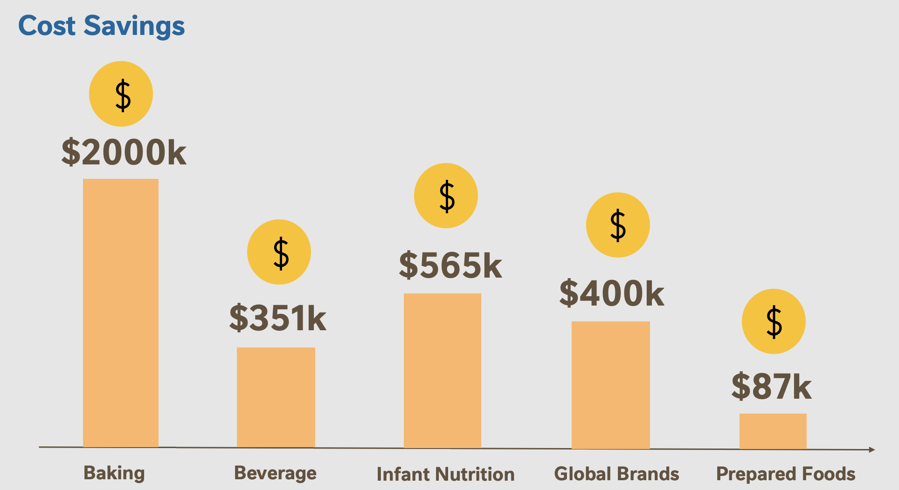

<h1>Forecasting Nestlé's product demand Using Random Forests with Recursive Feature Elimination</h1>
I interned as a Data Scientist at Nestlé USA.
  This is the project that I worked on, which increased demand prediction accuracy by 9.4% from existing models, translating into cost savings of $3.4 million.
<li> SQL to query and manipulate big data on SAS.
<li> Designed, implemented, and back-tested optimal models using custom scoring metrics.
<li> Feature selection using Recursive Feature Elimination.
<li> Data visualisation dashboarding on Microsoft Power BI to depict business impact of new models.

# About
My work involved improving Nestlé's existing demand forecasting models through 3 aspects, as follows:

## 1. Feature selection tool: Recursive Feature Elimination
Nestlé collects an enormous amount of data, such as demand data, promotional data, holiday data, and competitor data. With this large amount of features available to be used for modelling, the team required a robust feature selection tool.

The first aspect of my project involved designing an end-to-end framework for feature selection (code and documentation). The goal was to (i) Increase model accuracy through technical feature selection methods instead of human intuition and domain expertise, and (ii) Increase model explainability to non-technical stakeholders within Nestlé.

I designed an approach that utilized Recursive Feature Elimination (RFE) through Permutation Feature Importance with Random Forests. This new approach improves on the current feature selection approach used by the team through the following aspects:

## 2. Feature selection at different levels
Next, I explored different levels in which to conduct feature selection. Feature selection can be conducted at 3 main levels:

<li><b>Business level:</b> The term “business” at Nestlé refers to a category of products that Nestlé sells, examples being the Baking business, the Beverage business, and so on. Under this method, one would conduct feature selection for an entire business of products, and use this same selected features to forecast demand for all products under that business.

<li><b>Product level:</b> Within any one business, there are hundreds of products. For example, two different products within Nestlé’s Baking business are pies and cakes. Conducting feature selection at the product level instead would mean selecting features to use for forecasting demand for each unique product, and using different features in modelling between different products within the same business.

<li><b>Product and store level:</b> Nestlé sells its products at thousands of stores around the world. Different products are sold at each store. Conducting feature selection at the product and store level entails using different features for each product-store pair.

Among the 3 levels, I determine the optimal level at which feature selection should be conducted by back-testing across various time periods to find the level that results in the highest forecasting accuracy.

<h2>3. Benchmark suite of machine learning models: Elastic Net, Random Forest, XGBoost, Deep Neural Network</h2>
The team had primarily been using traditional Statistics-based models such as ARIMA, ARIMAX, and other regression-based models for time-series demand forecasting. However, they were keen to branch out and adopt other machine learning-based models. Hence, I also worked on benchmarking models that had not yet been used by the team prior, using a custom scoring metric termed Demand Planning Accurcacy at Nestlé.

# Results: Making an impact at Nestlé
My work increased the accuracy of product demand forecasts by 9.4% on average across 6 categories of Nestlé products, with the exact breakdown as follows:

This translates into cost savings of $3.4 million across the various categories:

# One cool takeaway:
Reducing bias in permutation feature importance in the presence of highly collinear features
Permutation feature importance is touted as the gold-standard method for obtaining true feature importances. This is as opposed to other methods such as impurity-based feature importances which tend to inflate the importance of continuous or high-cardinality categorical variables (Read more about this here! Beware Default Random Forest Importances). It works by randomly shuffling (permutating) each feature such that the relationship between that feature and the target is broken. With this relationship now broken, we use the same model to predict the target. The importance of the feature is then measured as the fall in accuracy of the model from before and after it was permuted.

However, trouble sets in when there exists highly collinear features in the data. In this case, permutating one feature will have little effect on the models performance because it can get the same information from a correlated feature. This leads to the traditional permutation feature importance method understating the importance of such features.

To overcome this problem, I group features that are collinear and permute them together as a meta-feature. This allows me to obtain the true unbiased importance of highly collinear features as a group.

# Project Methodology
## 1. Feature engineering: Transform time-series problem into supervised learning problem
<li>Lag variables of past demand and consumption information
<li>Rolling mean and rolling standard deviation of existing features
<li>Calendar signatures, eg. Week number in year

## 2. Encode categorical variables using Hash Encoding
The categorical variables in the dataset are of high cardinality. As such, I utilize Hash Encoding, which reduces the number of new features created from the encoding to a lower dimension. This dimension is chosen from a trade-off: The larger the number of dimensions, the more information we retain from the original categorical feature after encoding it. However, this also results in sparser feature matrices that may reduce the performance of any machine learning model.

## 3. Tune Random Forest using random search
Use Apache Spark backend to conduct this random search in parallel for faster runtime.

## 4. Obtain unbiased permutation feature importances
Taking extra care to group highly collinear features together to obtain unbiased importances.

## 5. Feature selection using Recursive Feature Elimination (RFE)
RFE is a recursive process in that it progressively considers smaller and smaller subsets of the original features. The process starts by using all the original features, building a Random Forest with them, and obtaining feature importance scores for all the features. This describes steps 1 and 2 outlined above. Next, we discard the feature identified to be the least important, and repeat the above. This repetition continues until the size of the feature set has been incrementally reduced by 1 until it becomes 0. Following which, the optimal feature subset is the one that produces the highest model accuracy score on the validation set.

## 6. Train model on optimal subset of features
Obtain test set predictions for various time periods to validate model

## 7. Repeat for various levels of forecasting to determine optimal level
As outlined above, there are 3 main levels of forecasting investigated: At the business level, product level, and product-store level.

## 8. Repeat for different models to determine optimal model
Machine learning is an iterative process. I explore the following models to determine the best for this project's use-case: Elastic Net, Random Forest, XGBoost, Deep Neural Network.

# Still curious?
I authored an internship report covering the details of my methodology. This report was given an A+ grade by Columbia Engineering faculty. You can find my paper <a href="___">here</a>, or my presentation slides <a href="___">here</a> :)
